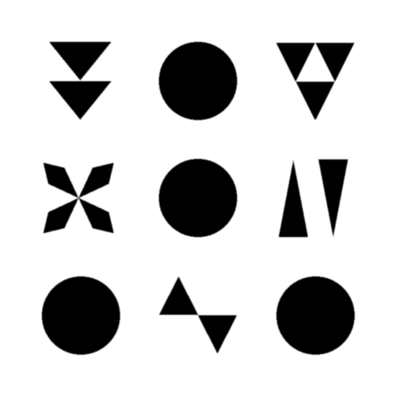
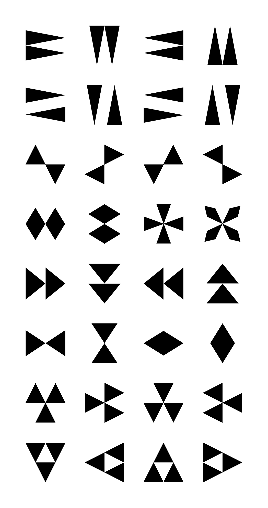

  
  <h1>Acute32</h1>

  

    <strong>The Symbolic Barcode made with triangles</strong>
  

  <h3>
    <a href="https://www.visioncortex.org/symcode-docs">Story</a>
     | 
    <a href="https://symcode.visioncortex.org/">Demo</a>
     | 
    <a href="https://github.com/visioncortex/acute32">Acute32</a>
  </h3>
  Built with 🦀 by <a href="//www.visioncortex.org/">The Vision Cortex Research Group</a>

## Sample SymCode

## Alphabet
